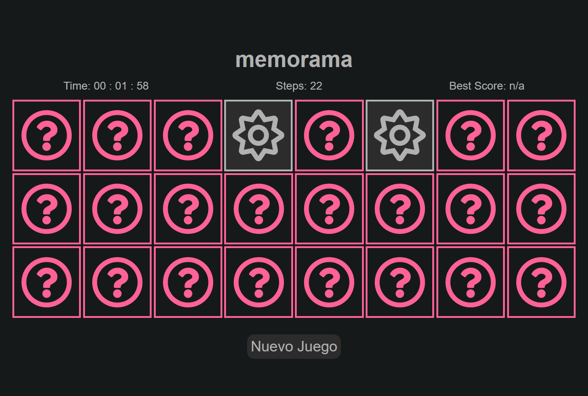

# Memorama

Juego de memoria en donde tendrás que buscar él pares de cartas en el menor tiempo posible. Tiene un cronómetro y un contador de pasos, el mejor puntaje se actualiza en el Localstorage.



### Built With 🛠️


* [html](https://developer.mozilla.org/es/docs/Web/HTML) 
* [css](https://developer.mozilla.org/es/docs/Web/CSS)
* [javaScript](https://developer.mozilla.org/es/docs/Web/JavaScript)


## Live demo 🔴

Sitio Web - [Memorama](https://diegorodriguez-sc.github.io/memorama/).


## Getting Started 🚀

Este es un ejemplo de cómo puede dar instrucciones sobre cómo configurar su proyecto localmente.
Para obtener una copia local en funcionamiento, siga estos sencillos pasos de ejemplo.

### Installation

1. Clone the repo
   ```sh
   https://github.com/DiegoRodriguez-sc/memorama.git
   ```
## Contact ☎️

 * [Linkedin](www.linkedin.com/in/diego-rodriguez-sc)

* Project Link: [https://github.com/DiegoRodriguez-sc/memorama](https://github.com/DiegoRodriguez-sc/memorama)